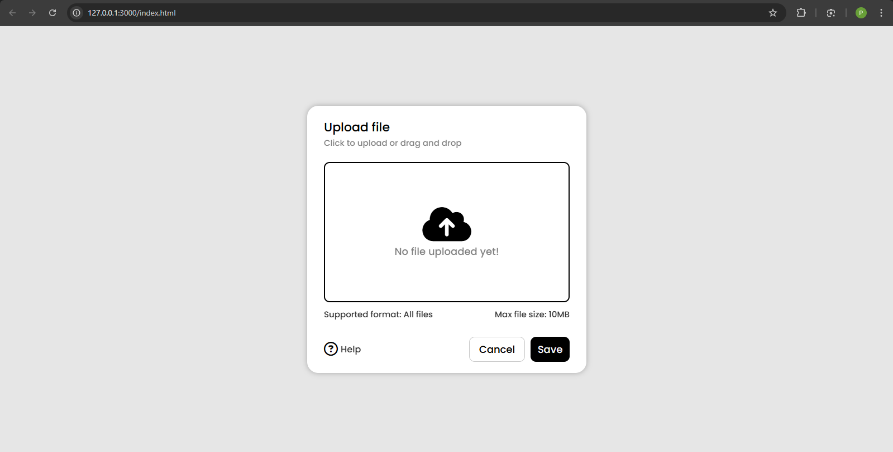

# File Upload Zone 📂

A clean and minimal **file upload interface** built using HTML, CSS, and JavaScript.  
Supports both **drag-and-drop** and **click-to-upload** functionalities.  
Users can easily upload files by either dropping them into the upload area or by selecting them via the file picker.



---

## ✨ Features
- 📥 **Drag & Drop Support** — Drop files directly into the upload area.
- 🖱 **Click to Upload** — Click on the upload area to open the file manager.
- 📄 **Any File Type** — Accepts all file formats.
- 📏 **File Size Limit** — Maximum file size of `10MB`.
- 🖌 **Clean UI** — Minimalist and responsive design.

---

## 📂 Project Structure
```
File-Upload-Zone/
│
├── index.html
├── style.css 
├── preview.png 
├── PYTHON_symbol.png
└── README.md
```

---

## 🚀 How to Use
1. Clone this repository:
   ```bash
   git clone https://github.com/your-username/File-Upload-Zone.git
2. Open index.html in your browser.

3. Upload files by:

      - Dragging & dropping into the upload box.
      
      - Clicking the upload box to open the file manager.
---
## 📌 Notes

This project is frontend only (no backend file handling).

Built as a UI component for integration into larger web applications.

---
Made with ❤️ by CodingWeapon
